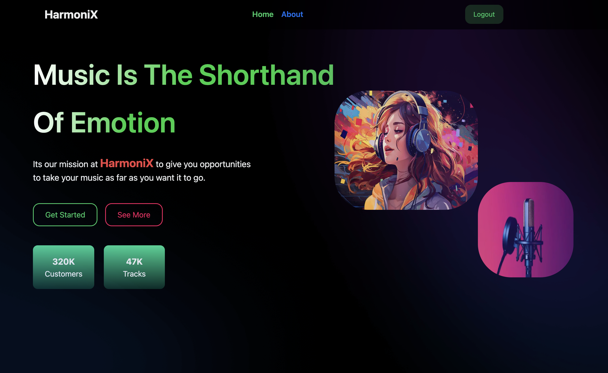

# HarmoniX 🎵  
A Next.js-based music management web application that allows users to customize playlists and listen to songs with ease. HarmoniX is designed to streamline the organization and enjoyment of music collections with powerful features like playlist management, song liking, sharing, and playback controls.

## Key Features
- **User Authentication**: Integrated Google Authentication for a seamless login and signup experience.
- **Playlist Customization**: Create, edit, and organize your playlists with ease.
- **Music Playback**: Enjoy full playback control with Play, Pause, Next, Previous, Shuffle, and Repeat options.
- **Like and Share Songs**: Like your favorite tracks and share them with others.
- **User Profiles**: Edit your profile to personalize your music experience.
- **Genre Exploration**: Browse and explore different music genres, tailored to your preferences.

## Technologies Used
- **Next.js**: For building a fast and interactive user interface.
- **MySQL**: To manage and store music data, playlists, and user information.
- **Google Auth**: For secure user authentication.
- **PL/SQL**: Used to implement 4 database triggers, 5 procedures, and optimized queries with indexes and keys for faster search results.

## Project Structure
- **Frontend Components**:
  - `/components`: Reusable UI components like Sidebar, Navbar, Buttons, and Icons.
  - `/pages`: Main pages such as Upload Song, Songs, Liked Songs, Genres, and Playlist management.
  - Example Pages:
    - `uploadsong.js`
    - `songs.js`
    - `signup.js`
    - `login.js`
    - `likedsongs.js`
    - `index.js`
    - `genres.js`
    - `editprofile.js`

- **Backend and Database**:
  - `/pages/api`: API routes to handle song data, user interactions, and playlist management.
  - `/pages/db.js`: Database connection and queries managed using MySQL and PL/SQL procedures and triggers.

## How to Run
1. Clone the repository.
2. Install dependencies: `npm install`
3. Set up a MySQL database and configure the connection in `db.js`.
4. Start the development server: `npm run dev`
5. Open [http://localhost:3000](http://localhost:3000) to view the app.

## Future Enhancements
- Add social media integrations for sharing playlists.
- Introduce user-specific recommendations based on listening history.
- Implement collaborative playlists for shared music experiences.
- Use AI to suggest new songs to user based on their previous songs